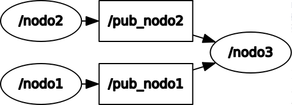

# ros_homework1 <br >First Homework - Laboratorio Ciberfisico UniVR

The exercise is the following <http://profs.scienze.univr.it/~bloisi/corsi/homework/homework-1.pdf> (Italian)


## Getting Started

### Prerequisites

You need [ROS Kinetic](http://wiki.ros.org/kinetic/Installation) installed and working <br >
Follow the tutorials at: <br > <http://wiki.ros.org/msg> <br > <http://wiki.ros.org/ROS/Tutorials/CreatingMsgAndSrv>
<br > If you need another tutorial about custom msgs you can watch [THIS](https://www.youtube.com/watch?v=ilRAlo5hi5o) video.

### Try it

Go in your catkin_ws folder, you can run the launch file by typing: <br >
```
roslaunch homework1 launch_file.launch
```
Note: ```homework1``` is the package's name <br >

You can choose a letter and then press the ENTER key to set what you want to see in output <br >
The avaiable options are the following: <br >
**a** -> displays Name, Age, Course <br >
**n** -> displays only Name <br >
**e** -> displays only Age <br >
**c** -> displays only Course <br >

Press `CTRL+C` to quit (sometimes it can be possible you need to insert another key and then press ENTER to correctly quit)

### Structure and Info
The msg's structure is in msg/personInfo.msg <br >
The node's structure is the following



Nodo1 send every 1 second a message to Nodo3 containing name, age, course information. Nodo3 saves the values received. Nodo2 is listening to a keyboard input and when ENTER key is pressed a message is sended to Nodo3 that will process the input and display the corresponding output.

## License
Before use it I invite you to read the LICENSE <br >
This file is distributed under the terms of the GNU Lesser General Public License (Lesser GPL) <br >
Visit <http://www.gnu.org/licenses/> <br >

## References

***Laboratorio Ciberfisico*** <br >
[Robot Programming with ROS](http://profs.scienze.univr.it/%7Ebloisi/corsi/ciberfisico.html) <br >
A.Y. 2017/2018 <br >
University of Verona (Italy) <br > <br >
Repository Author: <br >
**Edoardo Pieropan**
